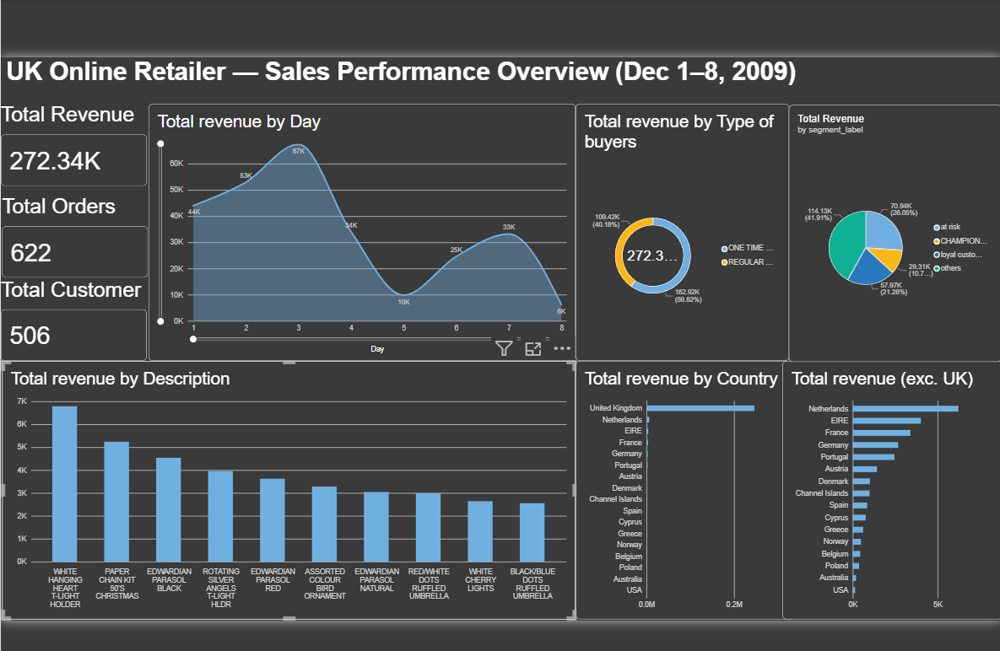

# UK Online Retailer — Sales Performance Analysis

## Overview
	-This Project is about the detailed analysis of sales report of a UK Online Retailer. I have used Real transaction data, invoices, products and customer details. This Project is build using MYSQL for data cleaning and modeling, and Power BI. It includes a dashboards that shows Top products, Customer segments, Sales trends, and Total revenue, Orders and Customers.

## Data Source
	-This project uses e-commerce transaction data (Online Retail II) sourced from Kaggle. It contains records of Products, Customer details, Order details, Price, Quantity and Invoice details with 13,010 rows after cleaning.

## Tools Used
	- MySQL (used for cleaning, schema designing, RFM and calculations)
	- Power BI (used for creating dashboard, visuals and Dax measures)

## Data Cleaning & Preparation
	-Removed the missing Customers id
	-Removed the negative quantities
	-Removed the cancelled orders
	-standardize product descriptions
	-Fixed the datatypes

## Database Design
	Tables built:
	- customers — customer ID and country
	- products — product code and description
	- orders — invoice number, customer, and order date
	- order_items — line-item details (product, quantity, price per order)
	- rfm_segments — calculated RFM scores and customer segment labels

	The raw flat dataset was normalized into these related tables to eliminate redundancy, establish clear relationships via primary/foreign key and support efficient querying.

## Key Business Insights
	-The top 10 customers contributed 23% of total revenue, showing a moderate reliance on a small group of high-value customers.
	- Netherlands was the top-performing country outside the UK, indicating strong potential for international growth in that market.
	-58% of customers are regular buyers; 42% are one‑time buyers — strong base with clear potential to increase repeat purchases.
	-The RFM identified there are 16 Champions customers, 151 Loyal customers, 180 customers at Risk (Repeat purchase behavior has dropped among this group) , 159 Others ,out of 506 customers. 
	-The top product which generated more revenue is "White Hanging Heart T-Light holder".

## Recommendations

	-Expand marketing efforts and promotions in the Netherlands to capitalize on strong international demand.
	- Launch a re-engagement campaign (e.g., personalized outreach or feedback surveys) for the 180 At Risk customers, while ensuring Loyal and Champion customers continue receiving recognition (such as loyalty perks) to avoid discount fairness concerns.
	-Focus on one‑time buyers to make them as regular buyers.
	-Investigate consistently low-performing products to determine whether to discontinue, reprice, or better promote them.

## Limitations
	-This analysis is based on an 8-day subset (Dec 1–8, 2009) of the full Online Retail II dataset, which spans nearly two years, due to import tool constraints encountered during the project. As a result, figures such as total revenue, order counts, and trends reflect this smaller window rather than the complete dataset.

	-However, the full data pipeline — cleaning logic, relational schema design, RFM segmentation, and dashboard structure — was built to scale directly to the complete dataset. Running the same process on the full ~1 million rows would produce more statistically robust insights, particularly for trend and frequency-based metrics like RFM Frequency scoring, without requiring any changes to the underlying design.

## Dashboard Preview
	

## Conclusion
	This project demonstrates an end-to-end data analysis workflow — from raw transaction data to a cleaned, relational database, through to a business-focused Power BI dashboard. It reflects practical skills in SQL (data cleaning, schema design, RFM segmentation) and data visualization, along with the ability to translate raw data into actionable business insights. With access to the full dataset, this same pipeline could be scaled to deliver even deeper, more statistically reliable insights.
